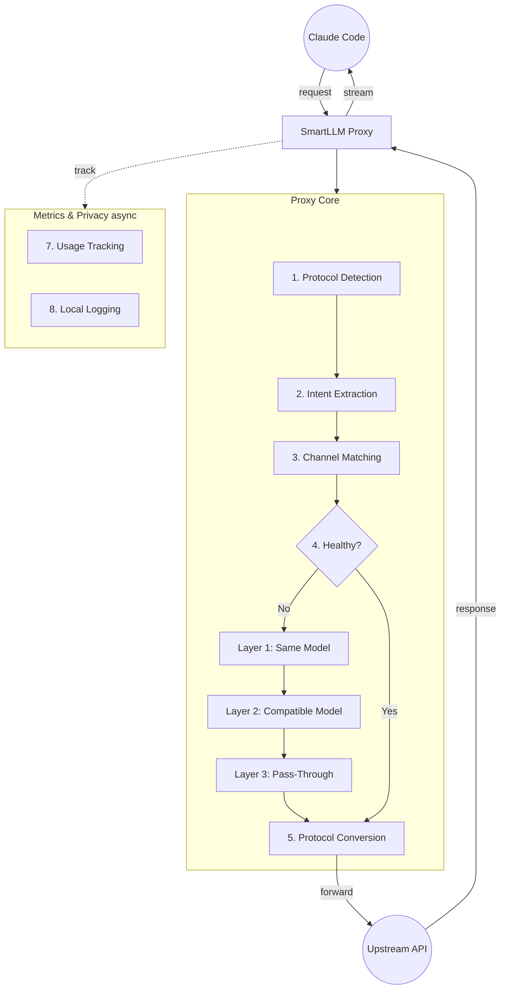
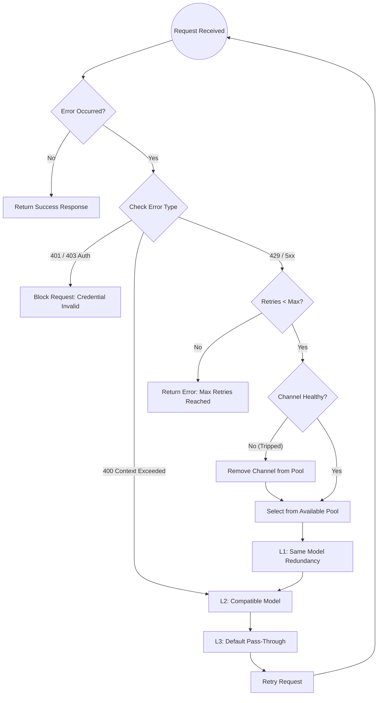

# 🚅 SmartLLM Router

A privacy-first local API gateway for LLMs, specifically optimized for **Claude Code** and developer workflows.

> 🇨🇳 [查看中文文档](README_ZH.md)

---

## 🇺🇸 Introduction

**SmartLLM Router** is a native macOS menu bar application that acts as a local HTTP gateway. It allows you to manage multiple API Keys from different providers (DeepSeek, OpenAI, Anthropic, Aliyun, MiniMax, etc.) and provides automatic failover and load balancing.

### Core Value
1.  **Model-Driven Routing**: Just select a model in your client. The proxy automatically finds the best provider that supports it. No manual switching.
2.  **Invisible Redundancy**: Multiple providers for the same model? If one fails, the proxy silently switches to another. You get the same model, different provider.
3.  **Protocol Isolation**: Strict separation between OpenAI and Anthropic ecosystems. Never see a Claude model in an OpenAI list.
4.  **Zero Client Configuration**: Claude Code only needs `ANTHROPIC_BASE_URL=http://localhost:1897`.
5.  **Privacy First**: 100% Local Execution. No telemetry, no cloud sync. Your API Keys stay in your Mac's Keychain.

### Key Features
*   ✅ **Multi-Provider Support**: Manage keys for Anthropic, OpenAI, DeepSeek, Aliyun DashScope, MiniMax, and more.
*   🔄 **Smart Auto-Failover**: Priority-based routing with intelligent cooldown (handles 429/5xx/401 errors silently).
*   🔀 **Protocol Adapter**: Seamless conversion between Anthropic (Claude) and OpenAI formats.
*   📊 **Real-time Stats**: Track daily token usage and estimated costs (30-day history).
*   📦 **Built-in Provider Metadata**: One-click setup for major providers via `providers.json`.
*   🛡️ **Local & Secure**: API Keys stored in macOS Keychain.

---

## 🏗️ Architecture



### Core Workflow
1.  **Detection & Extraction**: Claude Code sends requests to the local proxy, automatically identifying the protocol and extracting the requested model.
2.  **Model-Driven Routing**: Matches the best provider for the model, with a three-layer fallback guarantee (Same Model Redundancy → Compatible Model Degradation → Default Channel Pass-Through).
3.  **Protocol Conversion**: Transparently handles the conversion between OpenAI and Anthropic protocols.
4.  **Privacy Stats**: Locally records Token consumption and estimated costs. Keys are always masked.
5.  **Response Streaming**: Converted response streams are returned to Claude Code.

---

## 📉 Fallback Strategy

SmartLLM Router implements a **Layered Fallback** strategy with **Circuit Breaker** protection to ensure high availability and stability.



### Fallback Layers
*   **Layer 1 (Same Model)**: Tries other channels configured with the **exact same model**. Best for handling rate limits or transient outages.
*   **Layer 2 (Compatible Model)**: Tries a different model from the **same protocol family** that has **larger context** or higher capacity. Used for `context_length_exceeded` or model-specific outages.
*   **Layer 3 (Pass-Through)**: Falls back to the default channel as a last resort.

### Circuit Breaker
*   **Closed**: Normal operation.
*   **Open**: Channel has failed too many times (e.g., 3 consecutive failures or >60% failure rate). Temporarily excluded from the pool.
*   **Half-Open**: After a cool-down period, a single "probe" request is allowed. If successful, the channel is restored; otherwise, it remains Open.

---

## 🛠️ Development Guide

## Prerequisites
- macOS 13.0+
- Xcode 15.0+
- Homebrew (for Ruby 3.1)

## How to Build

### 1. Environment Setup
Ensure you have the correct Ruby version for CocoaPods. System Ruby (2.6) is too old.
```bash
brew install ruby@3.1
export PATH="/opt/homebrew/Cellar/ruby@3.1/3.1.7_1/bin:$PATH"
```

### 2. Build Steps (Strict Order)
⚠️ **ORDER MATTERS**: `xcodegen` must be run *before* `pod install`.

```bash
# Step 1: Generate Xcode Project
xcodegen generate

# Step 2: Install Dependencies
bundle exec pod install

# Step 3: Generate Localization Code (SwiftGen)
swiftgen config run

# Step 4: Build the App
xcodebuild -workspace SmartLLMRouter.xcworkspace -scheme SmartLLMRouter -destination 'platform=macOS' build
```

### 3. Running Tests
```bash
xcodebuild test -workspace SmartLLMRouter.xcworkspace -scheme SmartLLMRouter -destination 'platform=macOS' -only-testing:SmartLLMRouterTests
```

---

## 🚀 Usage

### 1. Quick Start
1.  **Install & Launch**: Run the app. The first launch will open the Onboarding Wizard.
2.  **Configure Channel**: Follow the wizard to add your API Key (e.g., DeepSeek or OpenAI).
3.  **Auto-Config Shell**: Click **"Help me configure"** in Settings to automatically update your `.zshenv`.
4.  **Start Coding**: Open your terminal and run Claude Code.

   ```bash
   # If you used auto-config, this is already set:
   export ANTHROPIC_BASE_URL=http://localhost:1897
   
   claude
   ```

### 2. Manual Setup
You can also manually export the variables in your shell profile:
```bash
export ANTHROPIC_BASE_URL=http://localhost:1897
export ANTHROPIC_API_KEY=placeholder # The proxy will handle the real key
```

---

## 🛣️ Roadmap

*   [x] **Phase 1**: Infrastructure, XcodeGen, CocoaPods setup, PRD Finalization.
*   [x] **Phase 2**: Core Proxy Server & Protocol Adapter (SSE/JSON Transform).
*   [x] **Phase 3**: Routing Engine, Menu Bar UI, Settings UI, `providers.json`, Dark Mode.
*   [x] **Phase 4**: Auto-Failover Logic, Cooldown Engine, Usage Stats, Auto-Config Shell, Sparkle.
*   [x] **Phase 5**: Smart Model Fallback, 27-Component UI Library, Connection Test (4-Step Chain).
*   [ ] **Phase 6**: Advanced Metrics Dashboard (Health/Stats Tabs), Zero-Cost Health Checks.

---

## 📄 License

This project is open-source and available under the MIT License.
