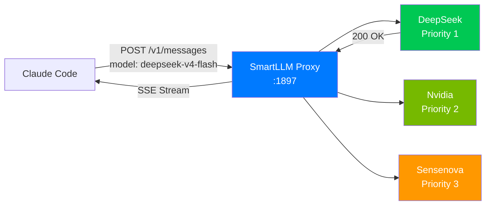
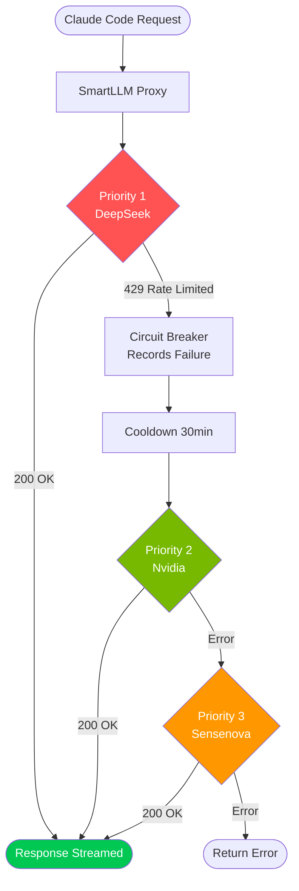
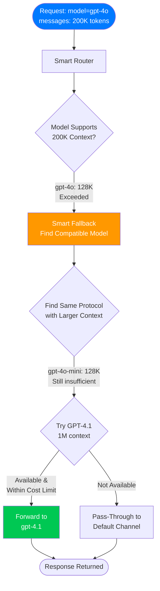
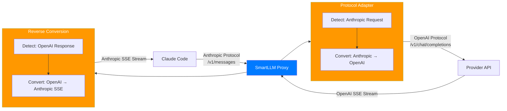
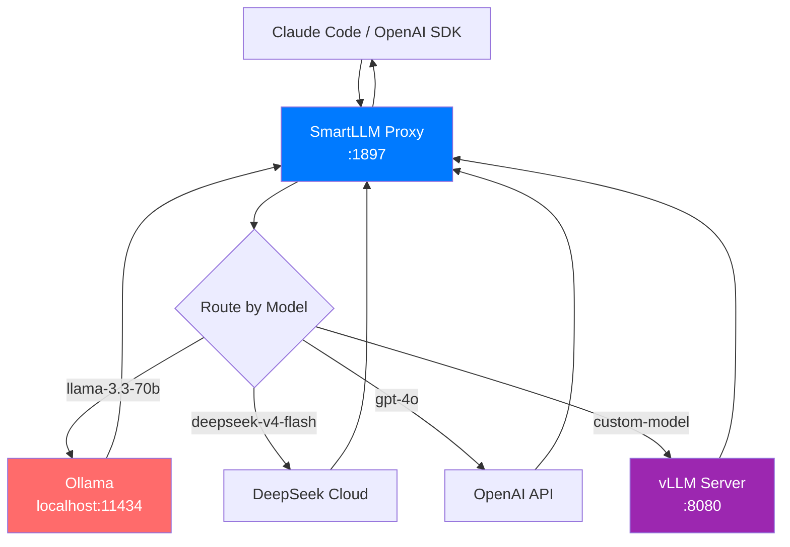
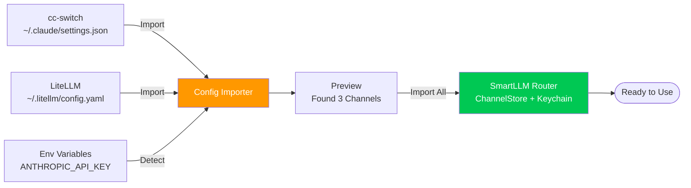
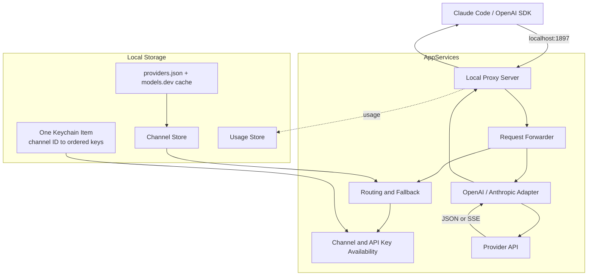
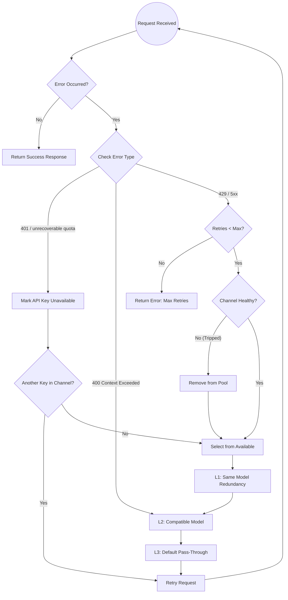

# 🚅 SmartLLM Router

A **lightweight, native macOS menu bar proxy** for Claude Code — protocol conversion, silent failover, and token stats across 42+ LLM providers. **100% local, privacy-first.**

> 🇨🇳 [查看中文文档](README_ZH.md) | 🌐 [Official Website](https://smartllmrouter.github.io)

---

## 🇺🇸 Introduction

**SmartLLM Router** is a lightweight, native macOS menu bar app that runs as a local HTTP proxy. Manage API keys from 42+ LLM providers (DeepSeek, OpenAI, Anthropic, Aliyun, MiniMax, and more) with automatic failover and load balancing — all running locally on your Mac.

### Why SmartLLM Router?

|  | SmartLLM Router | Cloud Proxies |
|---|---|---|
| **Lightweight** | ~8MB native binary, sips resources | Heavy runtimes, Docker required |
| **Native** | Swift + SwiftUI, macOS-native UX | Web UIs, Electron wrappers |
| **Privacy** | 100% local, keys in Keychain | Keys on third-party servers |

### Core Value
1.  **Model-Driven Routing**: Just select a model in your client. The proxy automatically finds the best provider that supports it. No manual switching.
2.  **Invisible Redundancy**: Multiple providers for the same model? If one fails, the proxy silently switches to another. You get the same model, different provider.
3.  **Protocol Isolation**: Strict separation between OpenAI and Anthropic ecosystems. Never see a Claude model in an OpenAI list.
4.  **Zero Client Configuration**: Claude Code only needs `ANTHROPIC_BASE_URL=http://localhost:1897`.
5.  **Privacy First**: 100% Local Execution. No telemetry, no cloud sync. Your API Keys stay in your Mac's Keychain.

### Key Features
*   ✅ **Multi-Provider Support**: Manage Anthropic and OpenAI-compatible channels, with built-in templates plus optional metadata refresh from `models.dev`.
*   🔑 **Multiple Keys per Channel**: Keep API keys in an explicit order and automatically skip a key that is rejected or exhausted.
*   🔄 **Smart Auto-Failover**: Priority-based routing with channel cooldowns and in-memory credential availability tracking for 401 and unrecoverable quota/billing errors.
*   🔀 **Protocol Adapter**: Seamless conversion between Anthropic (Claude) and OpenAI formats.
*   📊 **Real-time Stats**: Track daily token usage and estimated costs (30-day history).
*   📤 **Config Export & Import**: One-click export all channels (optional AES-GCM encryption). Share with teammates — they import in one click. Duplicate detection prevents overwrites.
*   🔄 **Sparkle Auto-Update**: Stay up to date with built-in Sparkle update checks.
*   📦 **Provider Metadata**: Built-in `providers.json` templates, refreshed from `models.dev` at most once per day or on demand.
*   🛡️ **Local & Secure**: All channel API keys are stored as JSON in one macOS Keychain item.

---

## 📥 Install (First-Time Setup)

Download the latest DMG from the [Releases page](https://github.com/rickytan/SmartLLMRouter/releases), open it, and drag **SmartLLMRouter.app** into **Applications**.

Release artifacts are signed with a **Developer ID Application** certificate, built with the hardened runtime, notarized by Apple, and stapled before publishing. Sparkle checks the signed appcast at `https://smartllmrouter.github.io/appcast.xml` for updates.

Pre-release tags such as `v1.0.1-alpha.6` and `v1.0.1-beta` become the version shown in About. CI sets `CURRENT_PROJECT_VERSION` from the first six characters of the build commit hash.

---

## 🔌 Supported Proxy Endpoints

The local server exposes the primary Anthropic and OpenAI-compatible APIs:

- `POST /v1/messages`
- `POST /v1/chat/completions`
- `GET /v1/models` and `GET /v1/models/:modelId`
- `POST /v1/embeddings`
- `POST /v1/images/generations`, `/v1/images/edits`, and `/v1/images/variations`
- `POST /v1/audio/speech`, `/v1/audio/transcriptions`, and `/v1/audio/translations`
- `POST /v1/moderations`
- `GET`, `POST`, and `DELETE /v1/files`, including file content retrieval

`/v1/models` aggregates enabled models across all available channels and removes duplicate model identifiers.

---

## 🎯 Typical Use Cases

### Use Case 1: Claude Code with Multiple API Providers

The most common scenario — a developer uses Claude Code for daily work, with API keys from multiple providers for redundancy.



**Flow:**
1. Claude Code sends `model: "deepseek-v4-flash"` to `localhost:1897`
2. Proxy checks: DeepSeek supports `deepseek-v4-flash`? → Yes → Forward to DeepSeek
3. DeepSeek responds → Stream back to Claude Code
4. If DeepSeek is down → Auto-fallback to Nvidia (if it also supports the model)

**Setup:**
```bash
export ANTHROPIC_BASE_URL=http://localhost:1897
export ANTHROPIC_API_KEY=placeholder # SmartLLM Router supplies the provider key
claude
```

---

### Use Case 2: Rate Limit Failover (429 Handling)

When a provider hits rate limits, SmartLLM Router automatically retries with another provider — no interruption to your workflow.



**What happens:**
1. DeepSeek returns `429 Too Many Requests`
2. Circuit Breaker records failure, marks DeepSeek as "cooling down" (30 min)
3. Proxy automatically retries with Nvidia (Priority 2)
4. Nvidia returns 200 → Response streamed to Claude Code
5. Developer sees no interruption — the same model name works regardless of provider

---

### Use Case 3: Context Length Exceeded → Smart Model Fallback

When a request exceeds a model's context window, the proxy intelligently routes to a compatible model with larger capacity.



**Decision logic:**
1. Request asks for `gpt-4o` with 200K tokens → exceeds 128K context
2. Layer 1: Try other channels with `gpt-4o` → Same limit
3. Layer 2: Find compatible model (same protocol, larger context) → `gpt-4.1` (1M context)
4. Verify cost constraint → Within budget → Forward to `gpt-4.1`
5. Claude Code receives response as if nothing happened

---

### Use Case 4: Protocol Conversion (Anthropic ↔ OpenAI)

Claude Code speaks Anthropic protocol, but your best provider only supports OpenAI format. SmartLLM Router handles the conversion transparently.



**What's converted:**
- **Request**: System prompt injection, thinking parameter handling, tool definitions
- **Response**: OpenAI delta chunks → Anthropic SSE events, usage statistics mapping
- **Headers**: `Authorization: Bearer` ↔ `x-api-key` (protocol-specific auth)

---

### Use Case 5: Local Model + Cloud Hybrid

Developers running local models (Ollama, vLLM) alongside cloud APIs — SmartLLM Router unifies them behind a single endpoint.



**Setup in SmartLLM Router:**
- Add Ollama as a "Custom / Local" provider with `http://localhost:11434/v1`
- Add cloud providers with their respective API keys
- Configure model lists for each channel

**Result:** One `localhost:1897` endpoint serves all models — local and cloud.

---

### Use Case 6: Configuration Migration

Migrating from other tools (cc-switch, LiteLLM, ccLoad) to SmartLLM Router with zero data loss.



**Migration flow:**
1. Onboarding detects existing config files
2. Shows preview: "Found cc-switch (2 keys) and LiteLLM (3 providers)"
3. User clicks "Import All"
4. Channels and keys are imported (keys stored in Keychain)
5. Ready to use immediately

---

## 🏗️ Architecture



### Core Workflow
1.  **Detection & Extraction**: The local server accepts Anthropic and OpenAI-compatible endpoints and extracts the requested model.
2.  **Model-Driven Routing**: Enabled channels are evaluated in user-defined priority order; API keys are tried in their configured order.
3.  **Failure Isolation**: Temporary channel failures enter cooldown, while rejected or exhausted keys are skipped in memory for subsequent requests.
4.  **Protocol Conversion**: OpenAI and Anthropic requests, responses, tools, thinking blocks, usage, and SSE streams are adapted when required.
5.  **Local Persistence**: Channel metadata and usage stay in local stores; all API keys share one Keychain item keyed by channel ID.

---

## 📉 Fallback Strategy

SmartLLM Router implements a **Layered Fallback** strategy with **Circuit Breaker** protection.



### Fallback Layers
*   **Layer 1 (Same Model)**: Tries other channels with the **exact same model**. Best for rate limits.
*   **Layer 2 (Compatible Model)**: Tries a **same-protocol** model with larger context. Used for `context_length_exceeded`.
*   **Layer 3 (Pass-Through)**: Falls back to the default channel as a last resort.

### Circuit Breaker
*   **Closed**: Normal operation.
*   **Open**: Channel failed too many times. Temporarily excluded.
*   **Half-Open**: After cool-down, a probe request tests recovery.
*   The consecutive-failure threshold is configurable in **Settings > Advanced** (default: 5).

Credential availability is tracked separately from channel health. A rejected key is skipped for later requests during the current app session without disabling or deleting its channel. A key that returns 429 receives an expiring cooldown; when every usable key in a channel is cooling down, that channel is temporarily excluded. The 429 cooldown duration is configurable in **Settings > Advanced**.

---

## 🛠️ Development Guide

### Prerequisites
- macOS 13.0+
- Xcode 15.0+
- Homebrew (for Ruby 3.1)

### Build Steps (Strict Order)

```bash
# Step 1: Generate Xcode Project
xcodegen generate

# Step 2: Install Dependencies
bundle exec pod install

# Step 3: Generate Localization Code
swiftgen config run

# Step 4: Build
xcodebuild -workspace SmartLLMRouter.xcworkspace -scheme SmartLLMRouter -destination 'platform=macOS' build
```

### Run Tests
```bash
xcodebuild test \
  -workspace SmartLLMRouter.xcworkspace \
  -scheme SmartLLMRouter \
  -destination 'platform=macOS,arch=arm64' \
  -derivedDataPath /private/tmp/SmartLLMRouter-tests \
  -only-testing:SmartLLMRouterTests \
  -skip-testing:SmartLLMRouterUITests \
  CODE_SIGNING_ALLOWED=NO
```

---

## 🚀 Usage

### Quick Start
1.  **Install & Launch**: Run the app. First launch opens the Onboarding Wizard.
2.  **Configure Channel**: Follow the wizard to add your API Key.
3.  **Auto-Config Shell**: Click **"Help me configure"** in Settings to update `.zshenv`.
4.  **Start Coding**:

```bash
export ANTHROPIC_BASE_URL=http://localhost:1897
claude
```

### Manual Setup
```bash
export ANTHROPIC_BASE_URL=http://localhost:1897
export ANTHROPIC_API_KEY=placeholder # The proxy handles the real key
```

---

## 🛣️ Roadmap

*   [x] **Phase 1**: Infrastructure, XcodeGen, CocoaPods setup.
*   [x] **Phase 2**: Core Proxy Server & Protocol Adapter.
*   [x] **Phase 3**: Routing Engine, Menu Bar UI, Settings UI, Dark Mode.
*   [x] **Phase 4**: Auto-Failover, Cooldown Engine, Usage Stats, Auto-Config Shell, Sparkle.
*   [x] **Phase 5**: Smart Model Fallback, 27-Component UI Library, Connection Test.
*   [x] **Phase 6**: Multi-key channels, persistent enable/disable state, provider-template refresh, expanded endpoint forwarding, signed Sparkle releases.
*   [ ] **Next**: Advanced metrics and broader end-to-end compatibility coverage.

---

## 📄 License

This project is open-source and available under the MIT License.
