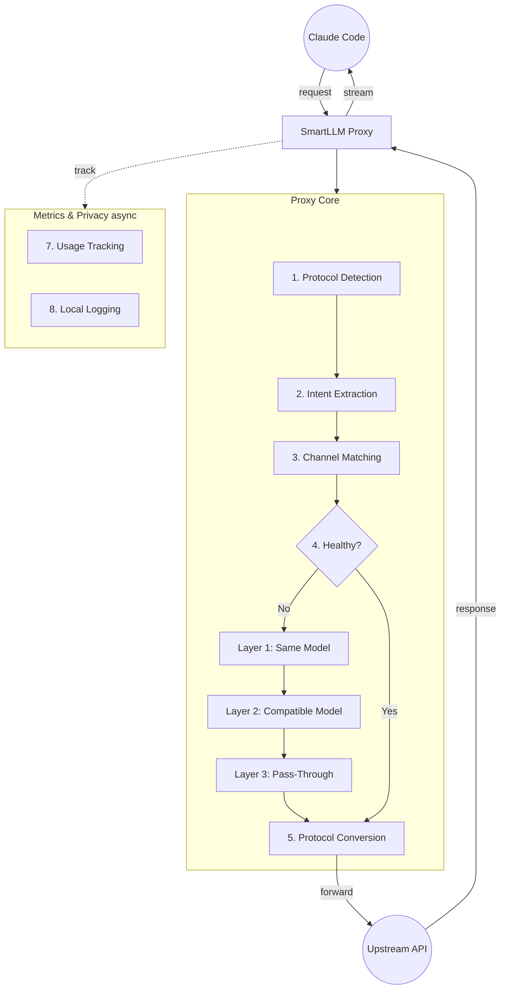
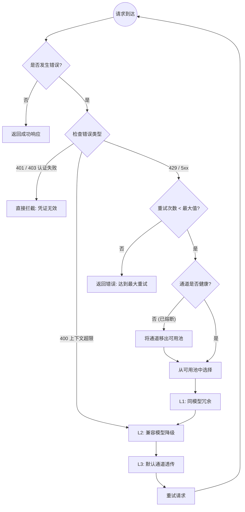

# 🚅 SmartLLM Router

专为 **Claude Code** 设计的隐私优先本地 LLM API 网关。

> 🇺🇸 [View English Documentation](README.md)

---

## 🇨🇳 简介

**SmartLLM Router** 是一款原生 macOS 菜单栏应用，作为一个本地 HTTP 网关运行。它允许你管理来自不同提供商（DeepSeek、OpenAI、Anthropic、阿里百炼、MiniMax 等）的多个 API Key，并提供自动故障转移和负载均衡能力。

### 核心价值
1.  **模型驱动路由**：在客户端直接选模型，代理自动寻找支持该模型的厂商。无需手动切换。
2.  **隐形冗余**：同一个模型配了多家厂商？若一家挂了，代理自动切到另一家。你用的是同一个模型，只是换了供应商。
3.  **协议隔离**：OpenAI 和 Anthropic 生态严格分离。绝不会在 OpenAI 列表里看到 Claude 模型。
4.  **零配置客户端**：Claude Code 只需配置 `ANTHROPIC_BASE_URL=http://localhost:1897`。
5.  **隐私优先**：100% 本地运行。无遥测，无云同步。API Key 仅存储在您的 Mac Keychain 中。

### 功能特性
*   ✅ **多厂商支持**：管理 Anthropic, OpenAI, DeepSeek, 阿里百炼, MiniMax 等渠道的 Key。
*   🔄 **智能自动切换**：基于优先级的路由，具备智能冷却机制（自动静默处理 429/5xx/401 错误）。
*   🔀 **协议适配器**：Anthropic (Claude) 与 OpenAI 格式之间的无缝转换。
*   📊 **实时统计**：追踪每日 Token 消耗和预估费用（30 天历史记录）。
*   📦 **内置供应商配置**：通过 `providers.json` 实现主流厂商的一键初始化。
*   🛡️ **本地安全**：API Key 存储在 macOS Keychain，数据绝不外发。

---

## 🏗️ 系统架构



### 核心工作流
1.  **识别与提取**: Claude Code 发送请求到本地代理，自动识别协议，提取请求模型。
2.  **模型驱动路由**: 根据模型匹配最佳厂商，包含三层降级保障（同模型冗余 → 兼容模型降级 → 默认通道透传）。
3.  **协议转换**: 透明处理 OpenAI 与 Anthropic 协议的互转。
4.  **隐私统计**: 本地记录 Token 消耗与预估费用，Key 全程脱敏。
5.  **响应返回**: 转换后的响应流回传给 Claude Code。

---

## 📉 降级策略

SmartLLM Router 实现了带有**熔断器**保护的**分层降级**策略，确保高可用性和稳定性。



### 降级层级
*   **Layer 1 (同模型冗余)**：尝试其他配置了**完全相同模型**的通道。最适合处理限流或瞬时故障。
*   **Layer 2 (兼容模型降级)**：尝试**同协议族**中具备**更大上下文**或更高容量的不同模型。用于处理 `context_length_exceeded` 或特定模型故障。
*   **Layer 3 (默认透传)**：作为最后的手段，回退到默认通道。

### 熔断器机制
*   **Closed (闭合)**：正常运行状态。
*   **Open (断开)**：通道失败次数过多（如连续 3 次失败或失败率 >60%）。暂时从可用池中剔除。
*   **Half-Open (半开)**：经过一段冷却时间后，允许一次“探测”请求。如果成功，通道恢复正常；否则保持断开。

---

## 🛠️ 开发指南

## 环境要求
- macOS 13.0+
- Xcode 15.0+
- Homebrew (用于安装 Ruby 3.1)

## 如何构建

### 1. 环境设置
确保你有正确版本的 Ruby 用于 CocoaPods。系统自带的 Ruby (2.6) 太旧了。
```bash
brew install ruby@3.1
export PATH="/opt/homebrew/Cellar/ruby@3.1/3.1.7_1/bin:$PATH"
```

### 2. 构建步骤 (严格顺序)
⚠️ **顺序很重要**：必须在 `pod install` 之前运行 `xcodegen`。

```bash
# 步骤 1: 生成 Xcode 项目
xcodegen generate

# 步骤 2: 安装依赖
bundle exec pod install

# 步骤 3: 生成本地化代码 (SwiftGen)
swiftgen config run

# 步骤 4: 构建应用
xcodebuild -workspace SmartLLMRouter.xcworkspace -scheme SmartLLMRouter -destination 'platform=macOS' build
```

### 3. 运行测试
```bash
xcodebuild test -workspace SmartLLMRouter.xcworkspace -scheme SmartLLMRouter -destination 'platform=macOS' -only-testing:SmartLLMRouterTests
```

---

## 🚀 使用指南

### 1. 快速开始
1.  **安装并启动**: 运行应用。首次启动将打开引导向导。
2.  **配置渠道**: 跟随向导添加你的 API Key（例如 DeepSeek 或 OpenAI）。
3.  **自动配置 Shell**: 在设置中点击 **"Help me configure"** 自动更新你的 `.zshenv`。
4.  **开始编码**: 打开终端并运行 Claude Code。

   ```bash
   # 如果你使用了自动配置，这行已经设置好了:
   export ANTHROPIC_BASE_URL=http://localhost:1897
   
   claude
   ```

### 2. 手动设置
你也可以在你的 shell 配置文件中手动导出变量：
```bash
export ANTHROPIC_BASE_URL=http://localhost:1897
export ANTHROPIC_API_KEY=placeholder # 代理将处理真实的 Key
```

---

## 🛣️ 开发计划

*   [x] **Phase 1**: 基础设施, XcodeGen, CocoaPods 设置, PRD 定稿。
*   [x] **Phase 2**: 核心代理服务器与协议适配器 (SSE/JSON 转换)。
*   [x] **Phase 3**: 路由引擎, 菜单栏 UI, 设置 UI, `providers.json`, 深色模式。
*   [x] **Phase 4**: 自动故障转移逻辑, 冷却引擎, 使用统计, 自动配置 Shell, Sparkle。
*   [x] **Phase 5**: 智能模型降级, 27 组件 UI 库, 连接测试 (4步链)。
*   [ ] **Phase 6**: 高级指标仪表盘 (健康/统计标签), 零成本健康检查。

---

## 📄 许可证

本项目是开源的，基于 MIT 许可证。
