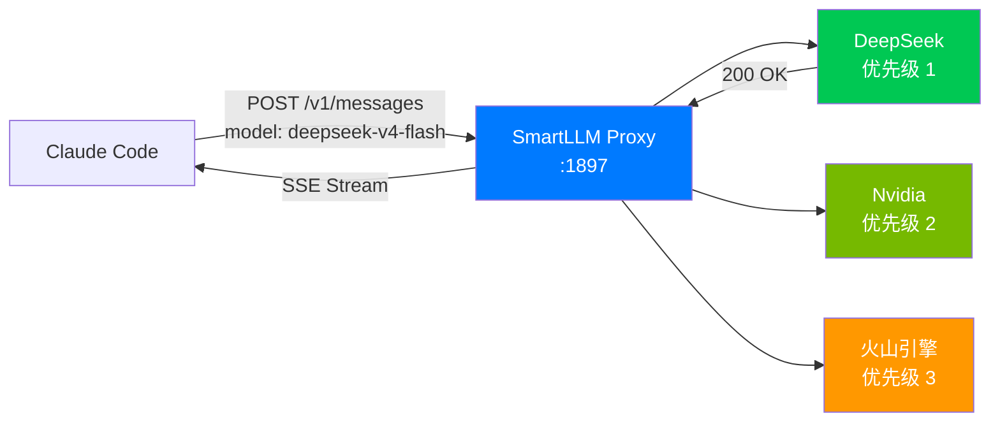
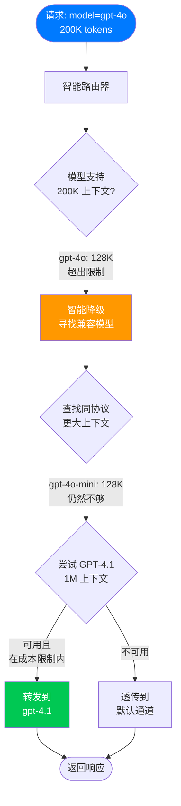
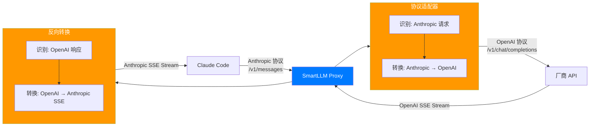
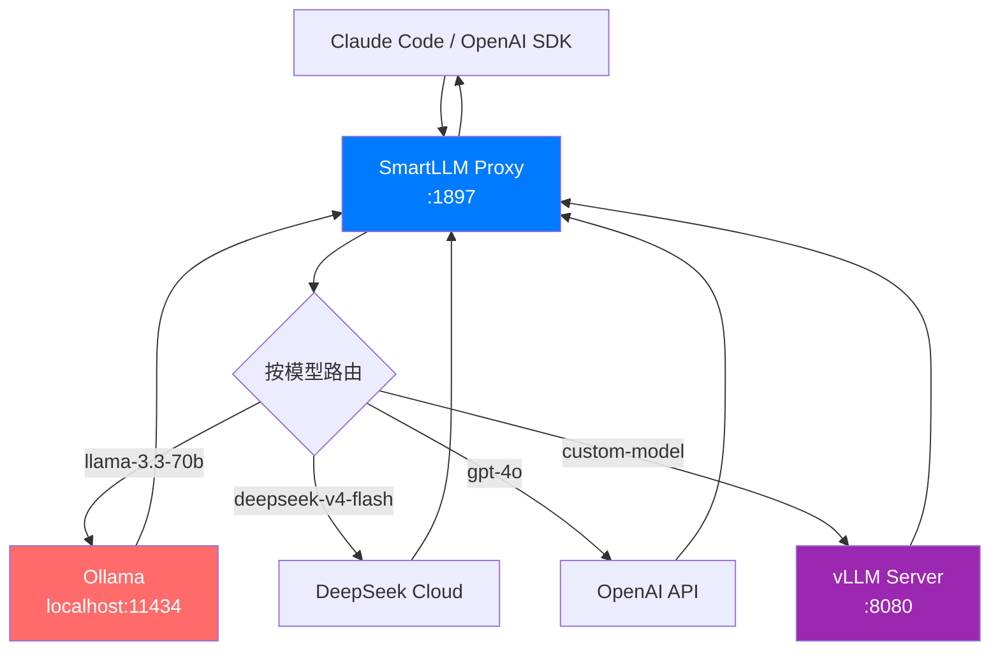
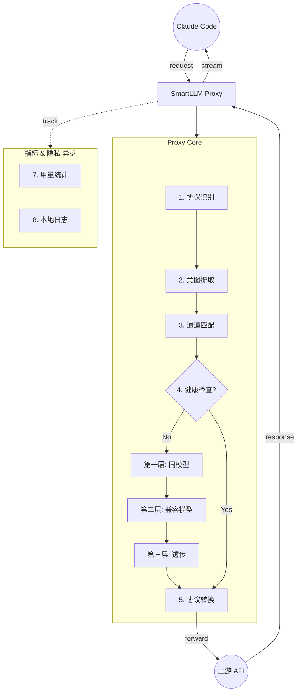
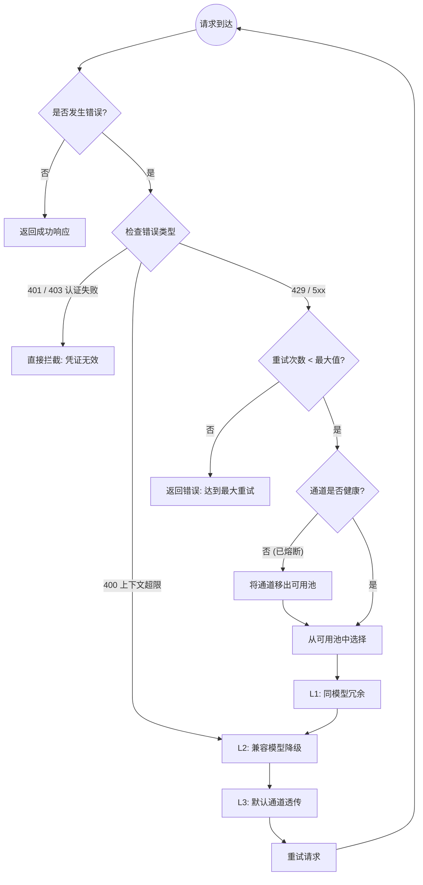

# 🚅 SmartLLM Router

专为 **Claude Code** 设计的隐私优先本地 LLM API 网关。

> 🇺🇸 [View English Documentation](README.md)

---

## 🇨🇳 简介

**SmartLLM Router** 是一款原生 macOS 菜单栏应用，作为一个本地 HTTP 网关运行。它允许你管理来自不同提供商的多个 API Key，并提供自动故障转移、智能路由和负载均衡能力。

### 核心价值
1.  **模型驱动路由**：在客户端直接选模型，代理自动寻找支持该模型的厂商。
2.  **隐形冗余**：同一个模型配了多家厂商？若一家挂了，代理自动切到另一家。
3.  **协议隔离**：OpenAI 和 Anthropic 生态严格分离。
4.  **零配置客户端**：Claude Code 只需配置 `ANTHROPIC_BASE_URL=http://localhost:1897`。
5.  **隐私优先**：100% 本地运行。无遥测，无云同步。API Key 仅存储在 Mac Keychain 中。

### 功能特性
*   ✅ **多厂商支持**：管理 Anthropic, OpenAI, DeepSeek, Nvidia, 火山引擎等渠道的 Key。
*   🔄 **智能自动切换**：基于优先级的路由，具备智能冷却和熔断器机制。
*   🔀 **协议适配器**：Anthropic (Claude) 与 OpenAI 格式之间的无缝转换。
*   📊 **实时统计**：追踪每日 Token 消耗和预估费用（30 天历史记录）。
*   📦 **内置供应商配置**：通过 `providers.json` 实现主流厂商的一键初始化。
*   🛡️ **本地安全**：API Key 存储在 macOS Keychain，数据绝不外发。

---

## 🎯 典型使用场景

### 场景一：Claude Code 多厂商 API 冗余

最常见的场景——开发者日常使用 Claude Code，配置多个厂商的 API Key 作为冗余。



**流程：**
1. Claude Code 发送 `model: "deepseek-v4-flash"` 到 `localhost:1897`
2. 代理检查：DeepSeek 支持 `deepseek-v4-flash`？→ 是 → 转发到 DeepSeek
3. DeepSeek 响应 → 流式返回给 Claude Code
4. 如果 DeepSeek 挂了 → 自动降级到 Nvidia（如果它也支持该模型）

**配置：**
```bash
export ANTHROPIC_BASE_URL=http://localhost:1897
claude
```

---

### 场景二：限流自动切换（429 处理）

当厂商触发限流，SmartLLM Router 自动重试其他厂商——你的工作流零中断。


**发生了什么：**
1. DeepSeek 返回 `429 Too Many Requests`
2. 熔断器记录失败，标记 DeepSeek 为"冷却中"（30 分钟）
3. 代理自动重试 Nvidia（优先级 2）
4. Nvidia 返回 200 → 响应流式返回给 Claude Code
5. 开发者感知不到中断——同一个模型名，换了供应商

---

### 场景三：上下文超限 → 智能模型降级

当请求超过模型的上下文窗口，代理智能路由到兼容的大容量模型。



**决策逻辑：**
1. 请求 `gpt-4o` 带 200K tokens → 超过 128K 上下文
2. 第一层：尝试其他通道的 `gpt-4o` → 同样限制
3. 第二层：寻找兼容模型（同协议，更大上下文）→ `gpt-4.1`（1M 上下文）
4. 验证成本约束 → 在预算内 → 转发到 `gpt-4.1`
5. Claude Code 收到响应，仿佛什么都没发生

---

### 场景四：协议转换（Anthropic ↔ OpenAI）

Claude Code 使用 Anthropic 协议，但你的最佳厂商只支持 OpenAI 格式。SmartLLM Router 透明处理转换。



**转换内容：**
- **请求**：系统提示注入、Thinking 参数处理、工具定义映射
- **响应**：OpenAI delta chunks → Anthropic SSE events、用量统计映射
- **头部**：`Authorization: Bearer` ↔ `x-api-key`（协议特定认证）

---

### 场景五：本地模型 + 云端混合

开发者同时运行本地模型（Ollama, vLLM）和云端 API——SmartLLM Router 将它们统一在一个端点后面。



**在 SmartLLM Router 中配置：**
- 添加 Ollama 为"自定义/本地"厂商，地址 `http://localhost:11434/v1`
- 添加云端厂商及其 API Key
- 为每个通道配置模型列表

**结果：** 一个 `localhost:1897` 端点服务所有模型——本地和云端。

---

### 场景六：配置迁移

从其他工具（cc-switch, LiteLLM, ccLoad）零数据丢失迁移到 SmartLLM Router。


**迁移流程：**
1. 引导流程检测到现有配置文件
2. 显示预览："发现 cc-switch（2 个 Key）和 LiteLLM（3 个厂商）"
3. 用户点击"全部导入"
4. 通道和 Key 被导入（Key 存入 Keychain）
5. 立即可用

---

## 🏗️ 系统架构



### 核心工作流
1.  **识别与提取**：Claude Code 发送请求到本地代理，自动识别协议，提取请求模型。
2.  **模型驱动路由**：根据模型匹配最佳厂商，包含三层降级保障。
3.  **协议转换**：透明处理 OpenAI 与 Anthropic 协议的互转。
4.  **隐私统计**：本地记录 Token 消耗与预估费用。
5.  **响应返回**：转换后的响应流回传给 Claude Code。

---

## 📉 降级策略

SmartLLM Router 实现了带有**熔断器**保护的**分层降级**策略。



### 降级层级
*   **Layer 1 (同模型冗余)**：尝试其他配置了**完全相同模型**的通道。最适合处理限流。
*   **Layer 2 (兼容模型降级)**：尝试**同协议族**中具备**更大上下文**的不同模型。
*   **Layer 3 (默认透传)**：作为最后的手段，回退到默认通道。

### 熔断器机制
*   **Closed (闭合)**：正常运行状态。
*   **Open (断开)**：通道失败次数过多。暂时从可用池中剔除。
*   **Half-Open (半开)**：经过冷却后，允许一次"探测"请求。成功则恢复；失败则保持断开。

---

## 🛠️ 开发指南

### 环境要求
- macOS 13.0+
- Xcode 15.0+
- Homebrew (用于安装 Ruby 3.1)

### 构建步骤 (严格顺序)

```bash
# 步骤 1: 生成 Xcode 项目
xcodegen generate

# 步骤 2: 安装依赖
bundle exec pod install

# 步骤 3: 生成本地化代码
swiftgen config run

# 步骤 4: 构建应用
xcodebuild -workspace SmartLLMRouter.xcworkspace -scheme SmartLLMRouter -destination 'platform=macOS' build
```

### 运行测试
```bash
xcodebuild test -workspace SmartLLMRouter.xcworkspace -scheme SmartLLMRouter -destination 'platform=macOS' -only-testing:SmartLLMRouterTests
```

---

## 🚀 使用指南

### 快速开始
1.  **安装并启动**: 运行应用。首次启动将打开引导向导。
2.  **配置渠道**: 跟随向导添加你的 API Key。
3.  **自动配置 Shell**: 在设置中点击 **"Help me configure"** 自动更新 `.zshenv`。
4.  **开始编码**:

```bash
export ANTHROPIC_BASE_URL=http://localhost:1897
claude
```

### 手动设置
```bash
export ANTHROPIC_BASE_URL=http://localhost:1897
export ANTHROPIC_API_KEY=placeholder # 代理将处理真实的 Key
```

---

## 🛣️ 开发计划

*   [x] **Phase 1**: 基础设施, XcodeGen, CocoaPods 设置。
*   [x] **Phase 2**: 核心代理服务器与协议适配器。
*   [x] **Phase 3**: 路由引擎, 菜单栏 UI, 设置 UI, 深色模式。
*   [x] **Phase 4**: 自动故障转移, 冷却引擎, 使用统计, 自动配置 Shell, Sparkle。
*   [x] **Phase 5**: 智能模型降级, 27 组件 UI 库, 连接测试。
*   [ ] **Phase 6**: 高级指标仪表盘, 零成本健康检查。

---

## 📄 许可证

本项目是开源的，基于 MIT 许可证。
