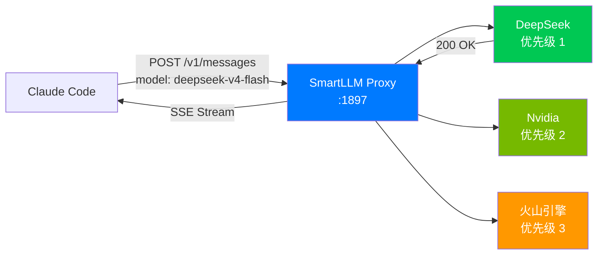
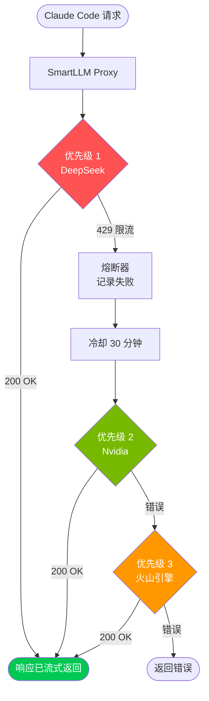
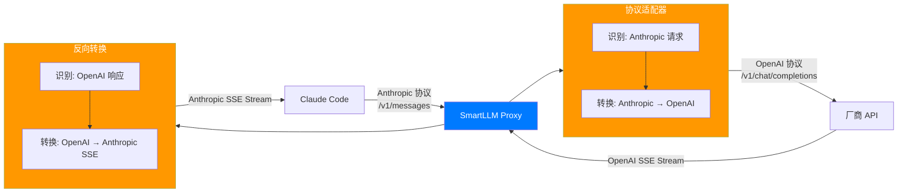
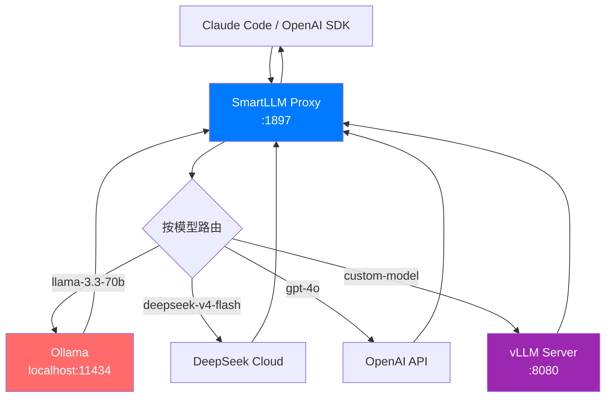
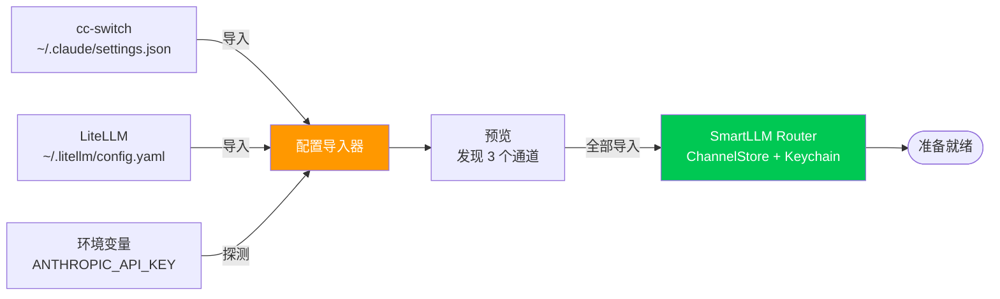
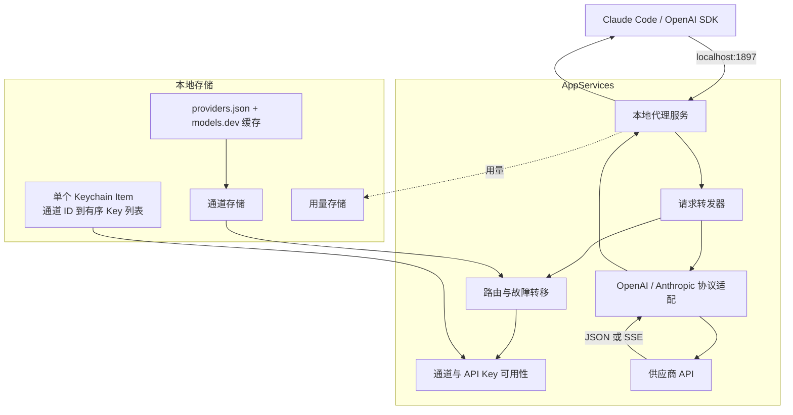
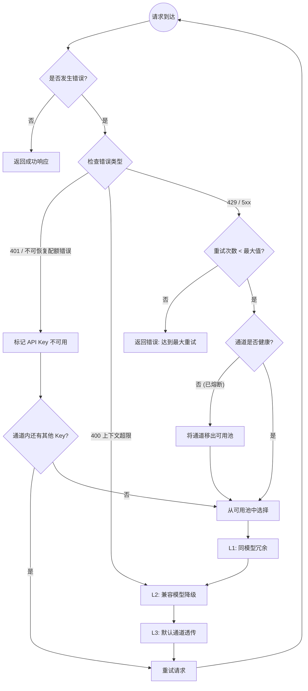

# 🚅 SmartLLM Router

**轻量、原生的 macOS 菜单栏代理**，专为 Claude Code 打造——协议转换、静默故障转移、Token 统计，覆盖 42+ LLM 厂商。**100% 本地运行，隐私安全。**

> 🇺🇸 [View English Documentation](README.md) | 🌐 [官方网站](https://smartllmrouter.github.io)

---

## 🇨🇳 简介

**SmartLLM Router** 是一款轻量、原生的 macOS 菜单栏应用，作为本地 HTTP 代理运行。管理来自 42+ LLM 厂商（DeepSeek、OpenAI、Anthropic、阿里百炼、MiniMax 等）的 API Key，具备自动故障转移和负载均衡——一切都在你的 Mac 本地完成。

### 为什么选择 SmartLLM Router？

|  | SmartLLM Router | 云端代理 |
|---|---|---|
| **轻量** | ~8MB 原生二进制，资源占用极低 | 笨重的运行时，需要 Docker |
| **原生** | Swift + SwiftUI，macOS 原生体验 | Web UI、Electron 套壳 |
| **隐私** | 100% 本地，Key 存于 Keychain | Key 存放在第三方服务器 |

### 核心价值
1.  **模型驱动路由**：在客户端直接选模型，代理自动寻找支持该模型的厂商。无需手动切换。
2.  **隐形冗余**：同一个模型配了多家厂商？若一家挂了，代理自动切到另一家。你用的是同一个模型，只是换了供应商。
3.  **协议隔离**：OpenAI 和 Anthropic 生态严格分离。绝不会在 OpenAI 列表里看到 Claude 模型。
4.  **零配置客户端**：Claude Code 只需配置 `ANTHROPIC_BASE_URL=http://localhost:1897`。
5.  **隐私优先**：100% 本地运行。无遥测，无云同步。API Key 仅存储在您的 Mac Keychain 中。

### 功能特性
*   ✅ **多厂商支持**：管理 Anthropic 和 OpenAI 兼容通道，支持内置模板与 `models.dev` 元数据更新。
*   🔑 **单通道多 Key**：API Key 可调整顺序，某个 Key 失效或额度用尽后自动跳过。
*   🔄 **智能自动切换**：基于优先级的路由，结合熔断状态、通道冷却与 401、429、不可恢复配额/账单错误的 Key 级内存标记。
*   🔀 **协议适配器**：Anthropic (Claude) 与 OpenAI 格式之间的无缝转换。
*   📊 **实时统计**：追踪请求数、输入/输出 Token、按通道用量和预估费用（30 天历史记录）。兼容供应商未返回 usage 时，成功响应会使用保守的本地估算。
*   📤 **配置导入导出**：一键导出所有通道配置（可选 AES-GCM 加密）。分享给同事，对方一键导入。重复检测防止覆盖已有配置。
*   🔄 **Sparkle 自动更新**：内置 Sparkle 更新检查，保持最新版本。
*   📦 **供应商元数据**：内置 `providers.json` 模板，每日最多自动从 `models.dev` 更新一次，也可手动强制刷新。
*   🧰 **诊断上报**：关于页的 Report Issue 可打开 GitHub issue，并可选择导出已脱敏的本地诊断包用于排查。
*   🛡️ **本地安全**：所有通道 API Key 以 JSON 形式集中存储在一个 macOS Keychain item 中。

---

## 📥 安装（首次使用）

从 [Releases 页面](https://github.com/rickytan/SmartLLMRouter/releases) 下载最新 DMG，打开后将 **SmartLLMRouter.app** 拖入 **Applications** 文件夹。

发布产物使用 **Developer ID Application** 证书签名，开启 Hardened Runtime，经过 Apple 公证并在发布前 stapling。Sparkle 通过 `https://smartllmrouter.github.io/appcast.xml` 检查已签名的更新。

`v1.0.1-alpha.6`、`v1.0.1-beta` 等预发布 Tag 会显示在“关于”页面；CI 使用构建对应 Git commit hash 的前 6 位设置 `CURRENT_PROJECT_VERSION`。

---

## 🔌 支持的代理接口

本地服务对外提供主要的 Anthropic 和 OpenAI 兼容接口：

- `POST /v1/messages`
- `POST /v1/chat/completions`
- `GET /v1/models` 与 `GET /v1/models/:modelId`
- `POST /v1/embeddings`
- `POST /v1/images/generations`、`/v1/images/edits` 与 `/v1/images/variations`
- `POST /v1/audio/speech`、`/v1/audio/transcriptions` 与 `/v1/audio/translations`
- `POST /v1/moderations`
- `GET`、`POST` 和 `DELETE /v1/files`，包括文件内容获取

`/v1/models` 会聚合所有可用通道中已启用的模型，并对模型标识去重。

---

## 🎯 典型使用场景

### 场景一：Claude Code 多厂商 API 冗余

最常见的场景——开发者日常使用 Claude Code，配置多个厂商的 API Key 作为冗余。



**流程：**
1. Claude Code 发送 `model: "deepseek-v4-flash"` 到 `localhost:1897`
2. 代理检查：DeepSeek 支持 `deepseek-v4-flash`？→ 是 → 转发到 DeepSeek
3. DeepSeek 响应 → 流式返回给 Claude Code
4. 如果 DeepSeek 挂了 → 自动降级到 Nvidia（如果它也支持该模型）

**配置：**
```bash
export ANTHROPIC_BASE_URL=http://localhost:1897
export ANTHROPIC_API_KEY=placeholder # 真实厂商 Key 由 SmartLLM Router 提供
claude
```

---

### 场景二：限流自动切换（429 处理）

当厂商触发限流，SmartLLM Router 自动重试其他厂商——你的工作流零中断。



**发生了什么：**
1. DeepSeek 返回 `429 Too Many Requests`
2. 熔断器记录失败，标记 DeepSeek 为"冷却中"（30 分钟）
3. 代理自动重试 Nvidia（优先级 2）
4. Nvidia 返回 200 → 响应流式返回给 Claude Code
5. 开发者感知不到中断——同一个模型名，换了供应商

---

### 场景三：上下文超限 → 智能模型降级

当请求超过模型的上下文窗口，代理智能路由到兼容的大容量模型。


**决策逻辑：**
1. 请求 `gpt-4o` 带 200K tokens → 超过 128K 上下文
2. 第一层：尝试其他通道的 `gpt-4o` → 同样限制
3. 第二层：寻找兼容模型（同协议，更大上下文）→ `gpt-4.1`（1M 上下文）
4. 验证成本约束 → 在预算内 → 转发到 `gpt-4.1`
5. Claude Code 收到响应，仿佛什么都没发生

---

### 场景四：协议转换（Anthropic ↔ OpenAI）

Claude Code 使用 Anthropic 协议，但你的最佳厂商只支持 OpenAI 格式。SmartLLM Router 透明处理转换。



**转换内容：**
- **请求**：系统提示注入、Thinking 参数处理、工具定义映射
- **响应**：OpenAI delta chunks → Anthropic SSE events、用量统计映射
- **头部**：`Authorization: Bearer` ↔ `x-api-key`（协议特定认证）

---

### 场景五：本地模型 + 云端混合

开发者同时运行本地模型（Ollama, vLLM）和云端 API——SmartLLM Router 将它们统一在一个端点后面。



**在 SmartLLM Router 中配置：**
- 添加 Ollama 为"自定义/本地"厂商，地址 `http://localhost:11434/v1`
- 添加云端厂商及其 API Key
- 为每个通道配置模型列表

**结果：** 一个 `localhost:1897` 端点服务所有模型——本地和云端。

---

### 场景六：配置迁移

从其他工具（cc-switch, LiteLLM, ccLoad）零数据丢失迁移到 SmartLLM Router。



**迁移流程：**
1. 引导流程检测到现有配置文件
2. 显示预览："发现 cc-switch（2 个 Key）和 LiteLLM（3 个厂商）"
3. 用户点击"全部导入"
4. 通道和 Key 被导入（Key 存入 Keychain）
5. 立即可用

---

## 🏗️ 系统架构



### 核心工作流
1.  **检测与提取**：本地服务接收 Anthropic 和 OpenAI 兼容接口，并提取请求的模型。
2.  **模型驱动路由**：按用户设定的优先级选择已启用通道，通道内按配置顺序尝试 API Key。
3.  **故障隔离**：临时通道错误进入冷却，已拒绝或额度用尽的 Key 会在内存中被跳过。
4.  **协议转换**：按需适配 OpenAI 与 Anthropic 的请求、响应、工具调用、thinking、用量与 SSE 流。
5.  **本地持久化**：通道元数据与用量保存在本地；所有 API Key 按通道 ID 存入同一个 Keychain item。

---

## 📉 降级策略

SmartLLM Router 实现了带有**熔断器**保护的**分层降级**策略。



### 降级层级
*   **Layer 1 (同模型冗余)**：尝试其他配置了**完全相同模型**的通道。最适合处理限流。
*   **Layer 2 (兼容模型降级)**：尝试**同协议族**中具备**更大上下文**的不同模型。
*   **Layer 3 (默认透传)**：作为最后的手段，回退到默认通道。

### 熔断器机制
*   **Closed (闭合)**：正常运行状态。
*   **Open (断开)**：通道失败次数过多。暂时从可用池中剔除。
*   **Half-Open (半开)**：经过冷却后，允许一次"探测"请求。成功则恢复；失败则保持断开。
*   连续失败阈值可在**设置 > 高级**中配置（默认 5 次）。
*   通道列表会直接显示熔断状态：正常通道使用常规状态标识，断开通道显示红色阻断状态，半开通道显示警告状态。

API Key 可用性与通道健康状态分开记录。被拒绝的 Key 在当前应用运行期间会被后续请求跳过，不会禁用或删除所属通道。返回 429 的 Key 会进入带过期时间的冷却；同一通道所有可用 Key 都在冷却时，该通道会被临时排除。429 冷却时长可在**设置 > 高级**中配置。

### 用量统计
*   供应商返回精确 usage 时，以供应商数据为准。
*   Anthropic 的 cache read/write input tokens 会计入输入 Token。
*   OpenAI 兼容和 Anthropic 成功响应未返回 usage 时，会使用保守的本地输入/输出估算，避免 Usage 页和菜单栏长期显示 0。
*   失败请求只记录请求本身，不会估算 Token。
*   Usage 页按通道聚合请求数、输入 Token、输出 Token 和预估费用。菜单栏 popover 按模型聚合最近请求，显示最新状态和输入/输出合计。

---

## 🛠️ 开发指南

### 环境要求
- macOS 13.0+
- Xcode 15.0+
- Homebrew (用于安装 Ruby 3.1)

### 构建步骤 (严格顺序)

```bash
# 步骤 1: 生成 Xcode 项目
xcodegen generate

# 步骤 2: 安装依赖
bundle exec pod install

# 步骤 3: 生成本地化代码
swiftgen config run

# 步骤 4: 构建应用
xcodebuild -workspace SmartLLMRouter.xcworkspace -scheme SmartLLMRouter -destination 'platform=macOS' build
```

### 运行测试
```bash
xcodebuild test \
  -workspace SmartLLMRouter.xcworkspace \
  -scheme SmartLLMRouter \
  -destination 'platform=macOS,arch=arm64' \
  -derivedDataPath /private/tmp/SmartLLMRouter-tests \
  -only-testing:SmartLLMRouterTests \
  -skip-testing:SmartLLMRouterUITests \
  CODE_SIGNING_ALLOWED=NO
```

---

## 🚀 使用指南

### 快速开始
1.  **安装并启动**: 运行应用。首次启动将打开引导向导。
2.  **配置渠道**: 跟随向导添加你的 API Key。
3.  **自动配置 Shell**: 在设置中点击 **"Help me configure"** 自动更新 `.zshenv`。
4.  **开始编码**:

```bash
export ANTHROPIC_BASE_URL=http://localhost:1897
claude
```

### 手动设置
```bash
export ANTHROPIC_BASE_URL=http://localhost:1897
export ANTHROPIC_API_KEY=placeholder # 代理将处理真实的 Key
```

---

## 🛣️ 开发计划

*   [x] **Phase 1**: 基础设施, XcodeGen, CocoaPods 设置。
*   [x] **Phase 2**: 核心代理服务器与协议适配器。
*   [x] **Phase 3**: 路由引擎, 菜单栏 UI, 设置 UI, 深色模式。
*   [x] **Phase 4**: 自动故障转移, 冷却引擎, 使用统计, 自动配置 Shell, Sparkle。
*   [x] **Phase 5**: 智能模型降级, 27 组件 UI 库, 连接测试。
*   [x] **Phase 6**: 单通道多 Key、通道启停持久化、供应商模板更新、扩展接口转发、签名 Sparkle 发布。
*   [ ] **下一步**: 高级指标仪表盘与更广泛的端到端兼容性测试。

---

## 📄 许可证

本项目是开源的，基于 MIT 许可证。
